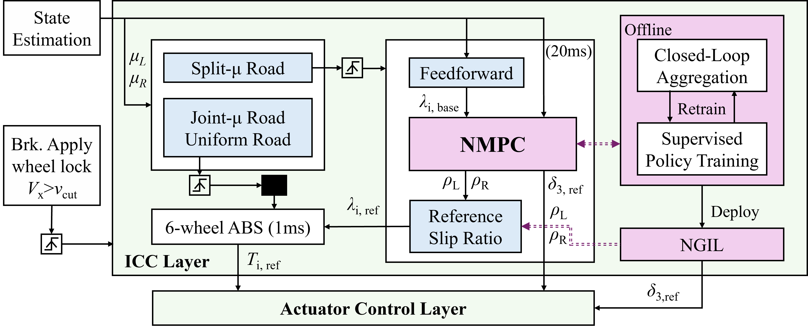
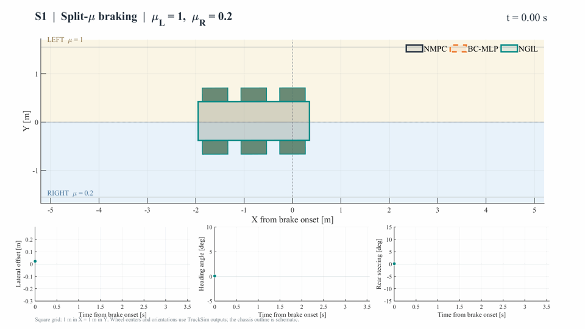
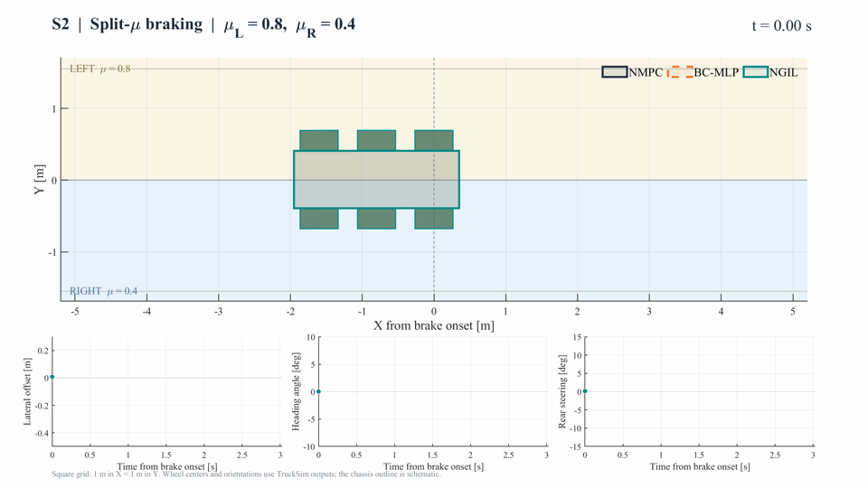
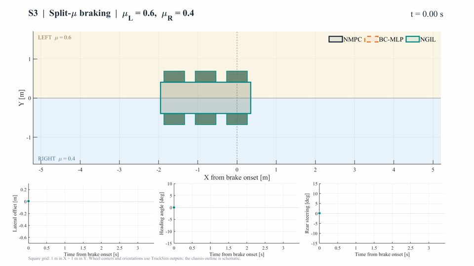
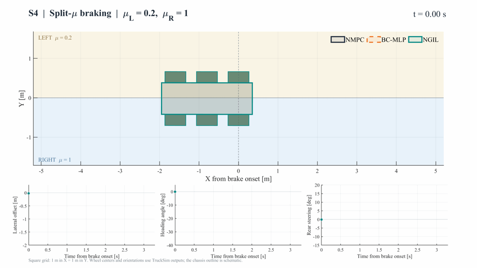
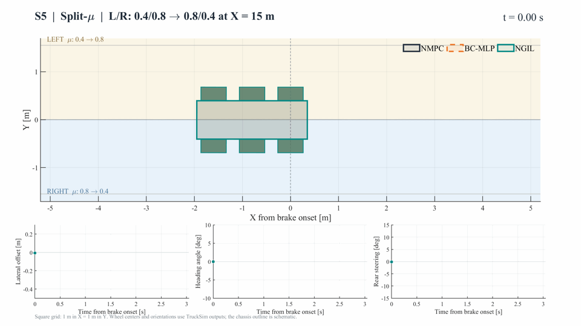
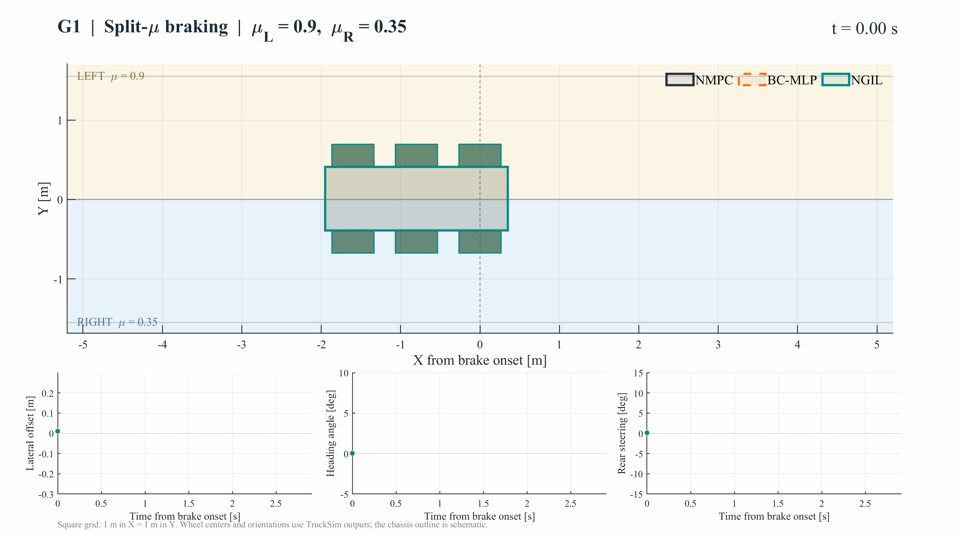
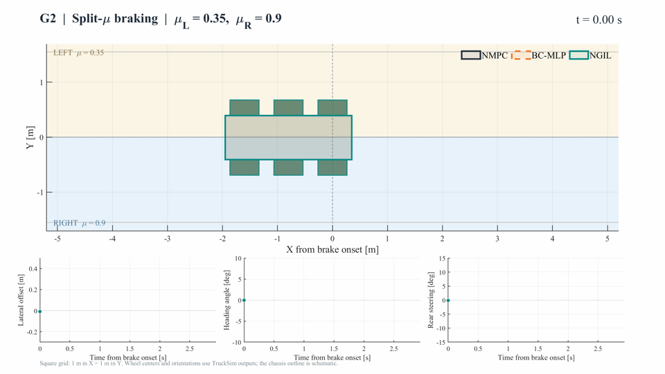
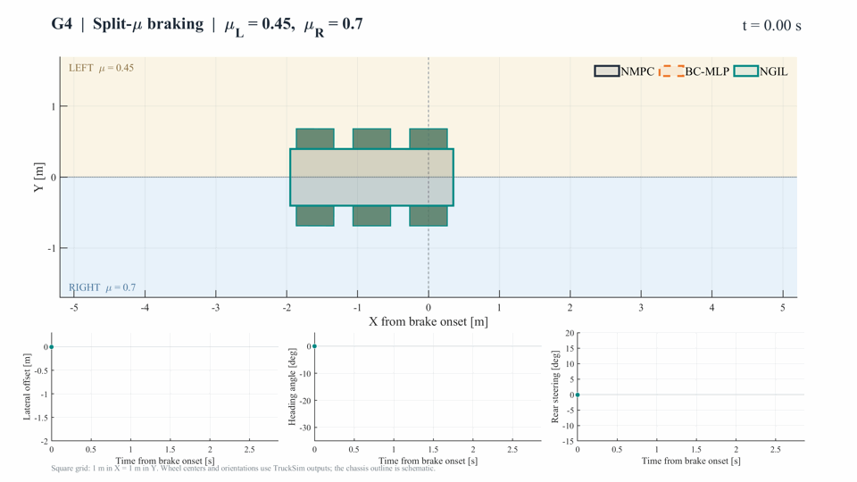
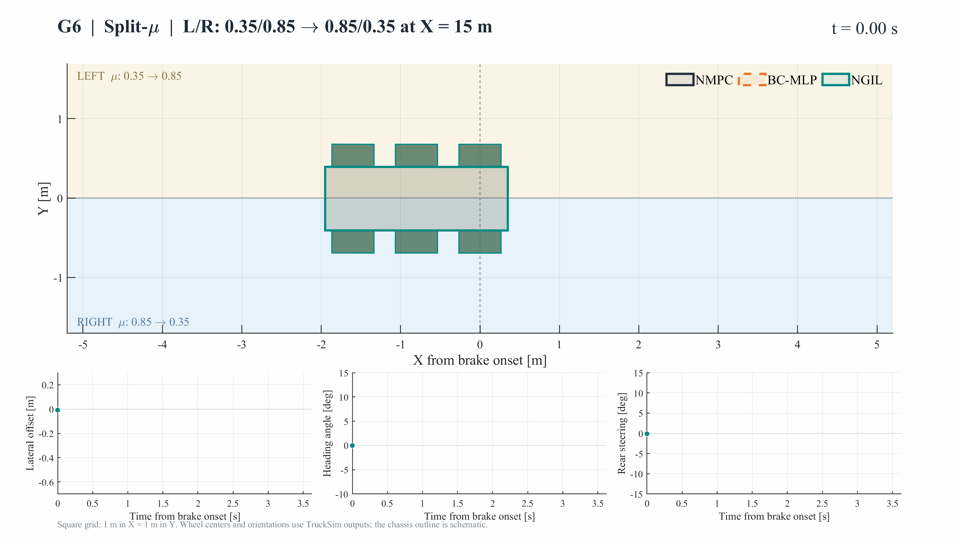

# NMPC-Guided Imitation Learning for Rear-Wheel-Steering-Assisted ABS on Split-μ Roads

**NGIL · NMPC-Guided Imitation Learning**

**Authors:** Ruiqi Fang, Weichao Zhuang, Jinhao Liang, Luca Dimauro, Alessandro Vigliani, Zhaoyu Qiu, Guodong Yin, and Aldo Sorniotti.

**Corresponding author:** Guodong Yin.

> This pre-publication release provides a project overview, the overall control framework, a limited MATLAB code preview, and qualitative animations. Trained models, datasets, vehicle parameters, Simulink models, and quantitative result tables are not included at this stage.

## Overview

Emergency braking on split-μ roads involves different tire–road friction levels on the left and right sides of a vehicle. Making greater use of the high-friction side can improve braking performance, but the resulting asymmetric braking forces also generate a yaw disturbance. The challenge is to use the available braking capacity while maintaining directional stability.

This project investigates **rear-wheel-steering-assisted anti-lock braking for a six-wheel vehicle**. Rear-wheel steering provides an additional means of compensating for the yaw disturbance. A reference-level coordinator determines how braking and steering should work together, while the existing wheel-level ABS continues to regulate wheel slip and generate brake-torque commands.

## Overall framework



*Reference-level coordination within the integrated chassis control (ICC) layer, with offline policy training and online deployment. NMPC and NGIL are alternative coordinators. The uniform-μ and joint-μ branches illustrate the surrounding software architecture; this project's focus is split-μ braking.*

## Key idea

The coordinator uses a common three-action interface:

| Coordinated action | Role |
|---|---|
| Left-side slip-reference release ratio | Adjusts the left-side braking slip references |
| Right-side slip-reference release ratio | Adjusts the right-side braking slip references |
| Rear-axle steering reference | Coordinates rear-wheel steering with braking |

The wheel-level ABS converts the resulting slip references into individual brake-torque commands. This separates vehicle-level braking–steering coordination from wheel-level slip control.

1. **NMPC expert:** A nonlinear model predictive controller determines coordinated references using predictions of vehicle motion, coupled tire forces, and actuator responses.
2. **Offline imitation learning:** Expert demonstrations and closed-loop data aggregation are used to train the NGIL coordination policy.
3. **Online deployment:** NGIL generates the coordinated references through neural-network inference, without solving the NMPC optimization problem online. It uses the same reference interface and lower-level execution path as the expert.

The research goal is to approximate the expert's closed-loop coordination behavior with lower online computational demand, while retaining the existing wheel-level ABS control loop.

## Research scope

The study focuses on constant and changing split-μ road conditions. Braking performance, directional stability, and online computational cost are the main evaluation aspects. Detailed formulations, calibration settings, quantitative comparisons, and manuscript materials are reserved for a subsequent release.

## Closed-loop animation gallery

Each GIF compares **NMPC**, a behavior-cloning **BC-MLP**, and **NGIL** in one scenario. The animations are 2D reconstructions from frozen TruckSim–Simulink closed-loop results, not native TruckSim 3D videos. Six wheel centers and orientations use recorded TruckSim outputs; the chassis outline is schematic. The animated X–Y view uses equal physical scales, with the brake-onset point set to X = 0. The lower panels show lateral offset, heading angle, and rear steering. Playback ends when longitudinal speed reaches 1.5 m/s; a method that reaches this threshold earlier remains at its final evaluated pose.

S1–S5 are the five development scenarios. G1–G6 are held-out friction combinations used for evaluation. For the transition scenarios, the arrow denotes the friction change at road station 45 m, which appears at approximately X = 15 m after brake onset. These visualizations show the tested cases only; they are not evidence of performance on every possible road condition.

| Scenario | Left/right road friction μL/μR | Animation |
|---|---|---|
| S1 | 1.0 / 0.2 | [View GIF](assets/animations/S1.gif) |
| S2 | 0.8 / 0.4 | [View GIF](assets/animations/S2.gif) |
| S3 | 0.6 / 0.4 | [View GIF](assets/animations/S3.gif) |
| S4 | 0.2 / 1.0 | [View GIF](assets/animations/S4.gif) |
| S5 | 0.4 / 0.8 → 0.8 / 0.4 | [View GIF](assets/animations/S5.gif) |
| G1 | 0.9 / 0.35 | [View GIF](assets/animations/G1.gif) |
| G2 | 0.35 / 0.9 | [View GIF](assets/animations/G2.gif) |
| G3 | 0.7 / 0.45 | [View GIF](assets/animations/G3.gif) |
| G4 | 0.45 / 0.7 | [View GIF](assets/animations/G4.gif) |
| G5 | 0.55 / 0.25 | [View GIF](assets/animations/G5.gif) |
| G6 | 0.35 / 0.85 → 0.85 / 0.35 | [View GIF](assets/animations/G6.gif) |

<details>
<summary>Show S1–S5 animations</summary>

### S1


### S2


### S3


### S4


### S5


</details>

<details>
<summary>Show G1–G6 animations</summary>

### G1


### G2


### G3


### G4


### G5


### G6


</details>

## Code preview

The following functions are currently provided as MATLAB P-code (`.p`): `parameters`, `controller_step`, `build_nmpc`, `solve_nmpc`, `vehicle_model`, `train_member`, and `predict_policy`. The data files `data/parameters.mat`, `data/policy.mat`, and `data/training.mat`, together with the completed Simulink model, are not included in this preview. The full source code, data, trained models, and Simulink model will be made public after the paper is accepted.

## Repository status

The public repository contains:

```text
README.md
assets/
├── framework.png
└── animations/
    └── S1.gif ... S5.gif, G1.gif ... G6.gif
code/
├── setup.m
├── parameters.p
├── control/
├── expert/
├── learning/
├── tests/
└── models/
```
